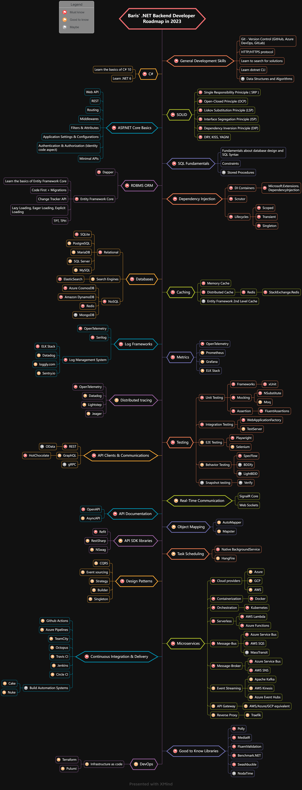

# .NET-Backend-Roadmap
 Here is the roadmap which I will use as a roadmap for backend software development as .NET developer.

 It includes the levels from zero to hero. 💯

 While creating my own roadmap, I was inspired by this [repository](https://github.com/Elfocrash/.NET-Backend-Developer-Roadmap). 🙌

 I use [Xmind.works](https://xmind.works/) to edit my roadmap.

Most of the elements are the same as referenced repository, I also extend the roadmap from my point of view, time to time.

